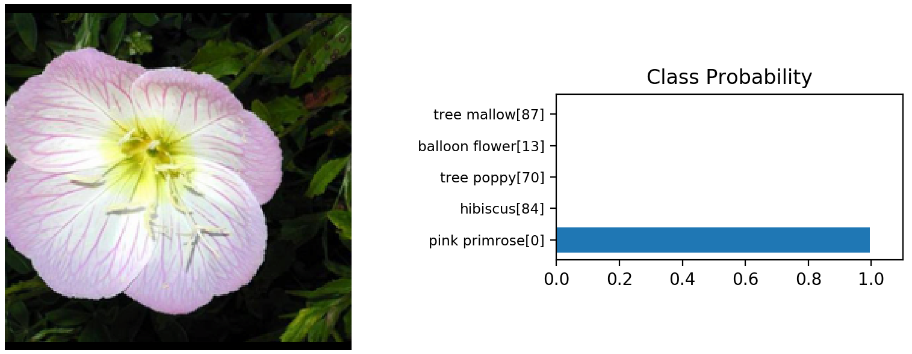

# ImageClassifier
Python image classifier for training, testing and predicting using deeplearning pre-trained models.

Import a pre-trained DL model to train the classifier layer to predict your own dataset.

## Requirements
- Install PyTorch ([pytorch.org](http://pytorch.org))
- `pip install -r requirements.txt`

## Available models
The code uses transfer learning from pre-trained Imagenet models. Currently supports:
- vgg13
- vgg16_bn
- densenet121
- resnet101

## Path to dataset to train or test
The code expects your dataset folder to have the following structure:

	dataset/
		train/
			class1/
				*.jpg
				...
			class2/
				*.jpg
				...
		valid/
			class1/
				*.jpg
				...
			class2/
				*.jpg
				...
		test/
			class1/
				*.jpg
				...
			class2/
				*.jpg
				...

## Usage train
```
usage: train.py [-h] [--ckp_file CKP_FILE] [--arch ARCH]
                [--hidden_units HIDDEN_UNITS [HIDDEN_UNITS ...]]
                [--learning_rate LEARNING_RATE] [--epochs EPOCHS]
                [--print_every PRINT_EVERY] [--save_dir SAVE_DIR] [--gpu]
                data_dir

Train an image classifier and saves the model

positional arguments:
  data_dir              Path to dataset to train

optional arguments:
  -h, --help            show this help message and exit
  --ckp_file CKP_FILE   Path to checkpoint to continue training. This ignores
                        arch and hidden_units
  --arch ARCH           Architecture to use
  --hidden_units HIDDEN_UNITS [HIDDEN_UNITS ...]
                        Number of hidden units
  --learning_rate LEARNING_RATE
                        Learning rate for training
  --epochs EPOCHS       Number of epochs for training
  --print_every PRINT_EVERY
                        Print every x steps in the training
  --save_dir SAVE_DIR   Directory to save model checkpoints
  --gpu                 Train using CUDA:0
```
### Example usage train
```bash
## New training using default settings:
python train.py "~/.torch/datasets/flowers" --gpu

## New training using custom settings:
python train.py "~/.torch/datasets/flowers" --gpu --save_dir=models --arch=vgg13 --learning_rate=0.001 --hidden_units 512 256 --epochs 10 

## Resume training
python train.py "~/.torch/datasets/flowers" --gpu --ckp_file "models\ckp_Flowers_vgg13_512_256_0.0001_20_best.pth" --epoch 10
```
<details>
  <summary>Example train execution</summary>
  <!-- have to be followed by an empty line! -->
	Note that time indicates validation time/last training steps time/remaining time

	python train.py "~/.torch/datasets/flowers" --save_dir=models --arch=vgg13 --learning_rate=0.001 --hidden_units 512 256 --epochs 10 --gpu

	Loading dataset Flowers from ~/.torch/datasets/flowers
	##############################
	Creating model: vgg13 with hidden_units: 512 256 and nclass: 102
	VGG(
	  (features): Sequential(
		(0): Conv2d(3, 64, kernel_size=(3, 3), stride=(1, 1), padding=(1, 1))
		(1): ReLU(inplace)
		(2): Conv2d(64, 64, kernel_size=(3, 3), stride=(1, 1), padding=(1, 1))
		(3): ReLU(inplace)
		(4): MaxPool2d(kernel_size=2, stride=2, padding=0, dilation=1, ceil_mode=False)
		(5): Conv2d(64, 128, kernel_size=(3, 3), stride=(1, 1), padding=(1, 1))
		(6): ReLU(inplace)
		(7): Conv2d(128, 128, kernel_size=(3, 3), stride=(1, 1), padding=(1, 1))
		(8): ReLU(inplace)
		(9): MaxPool2d(kernel_size=2, stride=2, padding=0, dilation=1, ceil_mode=False)
		(10): Conv2d(128, 256, kernel_size=(3, 3), stride=(1, 1), padding=(1, 1))
		(11): ReLU(inplace)
		(12): Conv2d(256, 256, kernel_size=(3, 3), stride=(1, 1), padding=(1, 1))
		(13): ReLU(inplace)
		(14): MaxPool2d(kernel_size=2, stride=2, padding=0, dilation=1, ceil_mode=False)
		(15): Conv2d(256, 512, kernel_size=(3, 3), stride=(1, 1), padding=(1, 1))
		(16): ReLU(inplace)
		(17): Conv2d(512, 512, kernel_size=(3, 3), stride=(1, 1), padding=(1, 1))
		(18): ReLU(inplace)
		(19): MaxPool2d(kernel_size=2, stride=2, padding=0, dilation=1, ceil_mode=False)
		(20): Conv2d(512, 512, kernel_size=(3, 3), stride=(1, 1), padding=(1, 1))
		(21): ReLU(inplace)
		(22): Conv2d(512, 512, kernel_size=(3, 3), stride=(1, 1), padding=(1, 1))
		(23): ReLU(inplace)
		(24): MaxPool2d(kernel_size=2, stride=2, padding=0, dilation=1, ceil_mode=False)
	  )
	  (avgpool): AdaptiveAvgPool2d(output_size=(7, 7))
	  (classifier): Sequential(
		(fc1): Linear(in_features=25088, out_features=512, bias=True)
		(relu1): ReLU()
		(drop1): Dropout(p=0.2)
		(fc2): Linear(in_features=512, out_features=256, bias=True)
		(relu2): ReLU()
		(drop2): Dropout(p=0.2)
		(fc3): Linear(in_features=256, out_features=102, bias=True)
	  )
	)
	##############################
	Optimizer:
	 Adam (
	Parameter Group 0
		amsgrad: False
		betas: (0.9, 0.999)
		eps: 1e-08
		lr: 0.001
		weight_decay: 0
	)
	##############################
	Training 10 epoch using cuda:0
	Epoch: 1/10..  Step: 10/205..  Train Loss: 4.771..  Valid Loss: 4.423..  Valid Accuracy: 0.073..  Time: 37s/54s/184m49s
	Epoch: 1/10..  Step: 20/205..  Train Loss: 4.325..  Valid Loss: 4.089..  Valid Accuracy: 0.175..  Time: 46s/63s/213m31s
	Epoch: 1/10..  Step: 30/205..  Train Loss: 4.180..  Valid Loss: 3.774..  Valid Accuracy: 0.233..  Time: 51s/73s/246m53s
	Epoch: 1/10..  Step: 40/205..  Train Loss: 3.945..  Valid Loss: 3.420..  Valid Accuracy: 0.284..  Time: 49s/70s/236m19s
	Epoch: 1/10..  Step: 50/205..  Train Loss: 3.733..  Valid Loss: 3.055..  Valid Accuracy: 0.314..  Time: 48s/68s/229m55s
	Epoch: 1/10..  Step: 60/205..  Train Loss: 3.560..  Valid Loss: 2.739..  Valid Accuracy: 0.369..  Time: 49s/70s/234m11s
	Epoch: 1/10..  Step: 70/205..  Train Loss: 3.015..  Valid Loss: 2.480..  Valid Accuracy: 0.428..  Time: 50s/70s/233m1s
	Epoch: 1/10..  Step: 80/205..  Train Loss: 2.952..  Valid Loss: 2.167..  Valid Accuracy: 0.477..  Time: 61s/83s/273m48s
	Epoch: 1/10..  Step: 90/205..  Train Loss: 2.670..  Valid Loss: 1.964..  Valid Accuracy: 0.507..  Time: 51s/72s/237m49s
	Epoch: 1/10..  Step: 100/205..  Train Loss: 2.701..  Valid Loss: 1.768..  Valid Accuracy: 0.542..  Time: 50s/71s/233m5s
	Epoch: 1/10..  Step: 110/205..  Train Loss: 2.499..  Valid Loss: 1.661..  Valid Accuracy: 0.562..  Time: 47s/67s/218m34s
	Epoch: 1/10..  Step: 120/205..  Train Loss: 2.363..  Valid Loss: 1.597..  Valid Accuracy: 0.588..  Time: 48s/68s/220m51s
	Epoch: 1/10..  Step: 130/205..  Train Loss: 2.283..  Valid Loss: 1.577..  Valid Accuracy: 0.595..  Time: 47s/68s/219m6s
	Epoch: 1/10..  Step: 140/205..  Train Loss: 2.204..  Valid Loss: 1.461..  Valid Accuracy: 0.601..  Time: 47s/68s/217m20s
	Epoch: 1/10..  Step: 150/205..  Train Loss: 2.193..  Valid Loss: 1.388..  Valid Accuracy: 0.647..  Time: 47s/68s/217m2s
	Epoch: 1/10..  Step: 160/205..  Train Loss: 2.152..  Valid Loss: 1.393..  Valid Accuracy: 0.628..  Time: 46s/68s/214m52s
	Epoch: 1/10..  Step: 170/205..  Train Loss: 2.009..  Valid Loss: 1.162..  Valid Accuracy: 0.678..  Time: 48s/69s/217m7s
	Epoch: 1/10..  Step: 180/205..  Train Loss: 1.883..  Valid Loss: 1.146..  Valid Accuracy: 0.680..  Time: 44s/66s/206m26s
	Epoch: 1/10..  Step: 190/205..  Train Loss: 2.013..  Valid Loss: 1.210..  Valid Accuracy: 0.681..  Time: 47s/68s/210m58s
	Epoch: 1/10..  Step: 200/205..  Train Loss: 1.987..  Valid Loss: 1.182..  Valid Accuracy: 0.685..  Time: 48s/68s/210m14s
	Epoch: 1/10..  Step: 205/205..  Train Loss: 1.870..  Valid Loss: 1.085..  Valid Accuracy: 0.707..  Time: 47s/57s/316m33s
	Checkpoint saved: models\ckp_Flowers_vgg13_512_256_0.001_last.pth
	Checkpoint saved: models\ckp_Flowers_vgg13_512_256_0.001_best.pth
	Epoch: 2/10..  Step: 10/205..  Train Loss: 1.649..  Valid Loss: 1.094..  Valid Accuracy: 0.692..  Time: 50s/69s/212m54s
	Epoch: 2/10..  Step: 20/205..  Train Loss: 1.667..  Valid Loss: 1.061..  Valid Accuracy: 0.714..  Time: 45s/64s/196m44s
	Epoch: 2/10..  Step: 30/205..  Train Loss: 1.516..  Valid Loss: 1.033..  Valid Accuracy: 0.731..  Time: 47s/67s/204m42s
	Epoch: 2/10..  Step: 40/205..  Train Loss: 1.836..  Valid Loss: 0.989..  Valid Accuracy: 0.718..  Time: 49s/69s/208m30s
	Epoch: 2/10..  Step: 50/205..  Train Loss: 1.634..  Valid Loss: 1.083..  Valid Accuracy: 0.699..  Time: 47s/67s/201m9s
	Epoch: 2/10..  Step: 60/205..  Train Loss: 1.514..  Valid Loss: 0.903..  Valid Accuracy: 0.730..  Time: 47s/67s/201m49s
	Epoch: 2/10..  Step: 70/205..  Train Loss: 1.567..  Valid Loss: 1.036..  Valid Accuracy: 0.706..  Time: 47s/67s/200m45s
	Epoch: 2/10..  Step: 80/205..  Train Loss: 1.513..  Valid Loss: 0.972..  Valid Accuracy: 0.716..  Time: 48s/68s/201m39s
	Epoch: 2/10..  Step: 90/205..  Train Loss: 1.563..  Valid Loss: 0.869..  Valid Accuracy: 0.748..  Time: 46s/66s/194m20s
	Epoch: 2/10..  Step: 100/205..  Train Loss: 1.577..  Valid Loss: 0.919..  Valid Accuracy: 0.741..  Time: 44s/65s/189m37s
	Epoch: 2/10..  Step: 110/205..  Train Loss: 1.628..  Valid Loss: 0.863..  Valid Accuracy: 0.764..  Time: 47s/68s/196m55s
	Epoch: 2/10..  Step: 120/205..  Train Loss: 1.494..  Valid Loss: 0.879..  Valid Accuracy: 0.755..  Time: 48s/67s/193m31s
	Epoch: 2/10..  Step: 130/205..  Train Loss: 1.505..  Valid Loss: 0.829..  Valid Accuracy: 0.776..  Time: 46s/65s/187m33s
	Epoch: 2/10..  Step: 140/205..  Train Loss: 1.490..  Valid Loss: 0.788..  Valid Accuracy: 0.783..  Time: 49s/68s/193m23s
	Epoch: 2/10..  Step: 150/205..  Train Loss: 1.486..  Valid Loss: 0.788..  Valid Accuracy: 0.779..  Time: 47s/67s/191m32s
	Epoch: 2/10..  Step: 160/205..  Train Loss: 1.517..  Valid Loss: 0.787..  Valid Accuracy: 0.770..  Time: 48s/67s/188m50s
	Epoch: 2/10..  Step: 170/205..  Train Loss: 1.432..  Valid Loss: 0.820..  Valid Accuracy: 0.777..  Time: 47s/66s/186m12s
	Epoch: 2/10..  Step: 180/205..  Train Loss: 1.386..  Valid Loss: 0.766..  Valid Accuracy: 0.784..  Time: 46s/66s/185m0s
	Epoch: 2/10..  Step: 190/205..  Train Loss: 1.434..  Valid Loss: 0.722..  Valid Accuracy: 0.802..  Time: 48s/67s/185m57s
	Epoch: 2/10..  Step: 200/205..  Train Loss: 1.262..  Valid Loss: 0.743..  Valid Accuracy: 0.794..  Time: 46s/66s/181m23s
	Epoch: 2/10..  Step: 205/205..  Train Loss: 1.447..  Valid Loss: 0.715..  Valid Accuracy: 0.797..  Time: 48s/58s/277m53s
	Checkpoint saved: models\ckp_Flowers_vgg13_512_256_0.001_last.pth
	Checkpoint saved: models\ckp_Flowers_vgg13_512_256_0.001_best.pth
	Epoch: 3/10..  Step: 10/205..  Train Loss: 1.104..  Valid Loss: 0.742..  Valid Accuracy: 0.789..  Time: 45s/63s/173m35s
	Epoch: 3/10..  Step: 20/205..  Train Loss: 1.323..  Valid Loss: 0.711..  Valid Accuracy: 0.803..  Time: 47s/68s/185m19s
	Epoch: 3/10..  Step: 30/205..  Train Loss: 1.349..  Valid Loss: 0.843..  Valid Accuracy: 0.769..  Time: 47s/67s/179m54s
	Epoch: 3/10..  Step: 40/205..  Train Loss: 1.230..  Valid Loss: 0.701..  Valid Accuracy: 0.798..  Time: 46s/66s/178m15s
	Epoch: 3/10..  Step: 50/205..  Train Loss: 1.109..  Valid Loss: 0.767..  Valid Accuracy: 0.788..  Time: 48s/65s/172m35s
	Epoch: 3/10..  Step: 60/205..  Train Loss: 1.454..  Valid Loss: 0.731..  Valid Accuracy: 0.792..  Time: 46s/65s/172m9s
	Epoch: 3/10..  Step: 70/205..  Train Loss: 1.274..  Valid Loss: 0.663..  Valid Accuracy: 0.829..  Time: 49s/67s/176m38s
	Epoch: 3/10..  Step: 80/205..  Train Loss: 1.136..  Valid Loss: 0.651..  Valid Accuracy: 0.837..  Time: 47s/66s/172m42s
	Epoch: 3/10..  Step: 90/205..  Train Loss: 1.048..  Valid Loss: 0.686..  Valid Accuracy: 0.815..  Time: 47s/67s/175m19s
	Epoch: 3/10..  Step: 100/205..  Train Loss: 1.304..  Valid Loss: 0.656..  Valid Accuracy: 0.824..  Time: 47s/66s/171m50s
	Epoch: 3/10..  Step: 110/205..  Train Loss: 1.116..  Valid Loss: 0.645..  Valid Accuracy: 0.819..  Time: 48s/70s/178m43s
	Epoch: 3/10..  Step: 120/205..  Train Loss: 1.264..  Valid Loss: 0.670..  Valid Accuracy: 0.814..  Time: 47s/66s/169m25s
	Epoch: 3/10..  Step: 130/205..  Train Loss: 1.206..  Valid Loss: 0.651..  Valid Accuracy: 0.836..  Time: 46s/66s/168m0s
	Epoch: 3/10..  Step: 140/205..  Train Loss: 1.230..  Valid Loss: 0.606..  Valid Accuracy: 0.832..  Time: 45s/63s/157m30s
	Epoch: 3/10..  Step: 150/205..  Train Loss: 1.229..  Valid Loss: 0.724..  Valid Accuracy: 0.801..  Time: 48s/67s/166m52s
	Epoch: 3/10..  Step: 160/205..  Train Loss: 1.341..  Valid Loss: 0.631..  Valid Accuracy: 0.813..  Time: 48s/67s/165m59s
	Epoch: 3/10..  Step: 170/205..  Train Loss: 1.379..  Valid Loss: 0.596..  Valid Accuracy: 0.828..  Time: 48s/67s/165m38s
	Epoch: 3/10..  Step: 180/205..  Train Loss: 1.236..  Valid Loss: 0.570..  Valid Accuracy: 0.851..  Time: 44s/62s/151m59s
	Epoch: 3/10..  Step: 190/205..  Train Loss: 1.109..  Valid Loss: 0.587..  Valid Accuracy: 0.837..  Time: 47s/68s/164m42s
	Epoch: 3/10..  Step: 200/205..  Train Loss: 1.283..  Valid Loss: 0.633..  Valid Accuracy: 0.837..  Time: 48s/66s/159m28s
	Epoch: 3/10..  Step: 205/205..  Train Loss: 1.411..  Valid Loss: 0.648..  Valid Accuracy: 0.836..  Time: 54s/63s/259m33s
	Checkpoint saved: models\ckp_Flowers_vgg13_512_256_0.001_last.pth
	Checkpoint saved: models\ckp_Flowers_vgg13_512_256_0.001_best.pth
	Epoch: 4/10..  Step: 10/205..  Train Loss: 1.170..  Valid Loss: 0.601..  Valid Accuracy: 0.822..  Time: 48s/68s/162m18s
	Epoch: 4/10..  Step: 20/205..  Train Loss: 1.165..  Valid Loss: 0.570..  Valid Accuracy: 0.843..  Time: 46s/64s/151m31s
	Epoch: 4/10..  Step: 30/205..  Train Loss: 1.022..  Valid Loss: 0.594..  Valid Accuracy: 0.842..  Time: 47s/66s/155m45s
	Epoch: 4/10..  Step: 40/205..  Train Loss: 1.105..  Valid Loss: 0.645..  Valid Accuracy: 0.823..  Time: 47s/67s/156m41s
	Epoch: 4/10..  Step: 50/205..  Train Loss: 1.120..  Valid Loss: 0.622..  Valid Accuracy: 0.838..  Time: 47s/66s/154m38s
	Epoch: 4/10..  Step: 60/205..  Train Loss: 1.049..  Valid Loss: 0.623..  Valid Accuracy: 0.835..  Time: 46s/66s/153m14s
	Epoch: 4/10..  Step: 70/205..  Train Loss: 1.074..  Valid Loss: 0.611..  Valid Accuracy: 0.834..  Time: 47s/67s/153m45s
	Epoch: 4/10..  Step: 80/205..  Train Loss: 1.215..  Valid Loss: 0.594..  Valid Accuracy: 0.837..  Time: 54s/73s/165m31s
	Epoch: 4/10..  Step: 90/205..  Train Loss: 1.250..  Valid Loss: 0.646..  Valid Accuracy: 0.825..  Time: 50s/71s/159m48s
	Epoch: 4/10..  Step: 100/205..  Train Loss: 0.999..  Valid Loss: 0.599..  Valid Accuracy: 0.832..  Time: 50s/68s/152m59s
	Epoch: 4/10..  Step: 110/205..  Train Loss: 1.102..  Valid Loss: 0.561..  Valid Accuracy: 0.845..  Time: 50s/70s/156m42s
	Epoch: 4/10..  Step: 120/205..  Train Loss: 1.031..  Valid Loss: 0.600..  Valid Accuracy: 0.824..  Time: 51s/69s/153m17s
	Epoch: 4/10..  Step: 130/205..  Train Loss: 1.085..  Valid Loss: 0.534..  Valid Accuracy: 0.842..  Time: 51s/70s/153m44s
	Epoch: 4/10..  Step: 140/205..  Train Loss: 1.052..  Valid Loss: 0.573..  Valid Accuracy: 0.833..  Time: 51s/70s/151m36s
	Epoch: 4/10..  Step: 150/205..  Train Loss: 1.015..  Valid Loss: 0.540..  Valid Accuracy: 0.844..  Time: 50s/70s/150m11s
	Epoch: 4/10..  Step: 160/205..  Train Loss: 1.128..  Valid Loss: 0.552..  Valid Accuracy: 0.844..  Time: 52s/72s/154m1s
	Epoch: 4/10..  Step: 170/205..  Train Loss: 1.155..  Valid Loss: 0.564..  Valid Accuracy: 0.852..  Time: 49s/68s/144m19s
	Epoch: 4/10..  Step: 180/205..  Train Loss: 1.067..  Valid Loss: 0.511..  Valid Accuracy: 0.852..  Time: 50s/72s/152m20s
	Epoch: 4/10..  Step: 190/205..  Train Loss: 1.113..  Valid Loss: 0.555..  Valid Accuracy: 0.852..  Time: 51s/67s/140m51s
	Epoch: 4/10..  Step: 200/205..  Train Loss: 1.253..  Valid Loss: 0.592..  Valid Accuracy: 0.830..  Time: 49s/70s/145m34s
	Epoch: 4/10..  Step: 205/205..  Train Loss: 1.107..  Valid Loss: 0.594..  Valid Accuracy: 0.824..  Time: 47s/58s/198m13s
	Checkpoint saved: models\ckp_Flowers_vgg13_512_256_0.001_last.pth
	Checkpoint saved: models\ckp_Flowers_vgg13_512_256_0.001_best.pth
	Epoch: 5/10..  Step: 10/205..  Train Loss: 1.235..  Valid Loss: 0.614..  Valid Accuracy: 0.840..  Time: 51s/70s/144m16s
	Epoch: 5/10..  Step: 20/205..  Train Loss: 1.038..  Valid Loss: 0.535..  Valid Accuracy: 0.854..  Time: 49s/69s/140m49s
	Epoch: 5/10..  Step: 30/205..  Train Loss: 1.050..  Valid Loss: 0.554..  Valid Accuracy: 0.854..  Time: 51s/71s/142m28s
	Epoch: 5/10..  Step: 40/205..  Train Loss: 1.328..  Valid Loss: 0.601..  Valid Accuracy: 0.848..  Time: 49s/69s/138m27s
	Epoch: 5/10..  Step: 50/205..  Train Loss: 0.883..  Valid Loss: 0.560..  Valid Accuracy: 0.844..  Time: 49s/71s/140m15s
	Epoch: 5/10..  Step: 60/205..  Train Loss: 0.997..  Valid Loss: 0.522..  Valid Accuracy: 0.851..  Time: 48s/69s/134m41s
	Epoch: 5/10..  Step: 70/205..  Train Loss: 1.072..  Valid Loss: 0.562..  Valid Accuracy: 0.842..  Time: 50s/70s/135m41s
	Epoch: 5/10..  Step: 80/205..  Train Loss: 1.019..  Valid Loss: 0.523..  Valid Accuracy: 0.863..  Time: 49s/69s/132m24s
	Epoch: 5/10..  Step: 90/205..  Train Loss: 1.018..  Valid Loss: 0.555..  Valid Accuracy: 0.856..  Time: 51s/72s/137m58s
	Epoch: 5/10..  Step: 100/205..  Train Loss: 1.150..  Valid Loss: 0.522..  Valid Accuracy: 0.863..  Time: 50s/72s/135m56s
	Epoch: 5/10..  Step: 110/205..  Train Loss: 1.047..  Valid Loss: 0.534..  Valid Accuracy: 0.858..  Time: 51s/72s/134m24s
	Epoch: 5/10..  Step: 120/205..  Train Loss: 1.084..  Valid Loss: 0.524..  Valid Accuracy: 0.863..  Time: 51s/71s/132m38s
	Epoch: 5/10..  Step: 130/205..  Train Loss: 0.989..  Valid Loss: 0.540..  Valid Accuracy: 0.857..  Time: 55s/78s/143m12s
	Epoch: 5/10..  Step: 140/205..  Train Loss: 1.191..  Valid Loss: 0.536..  Valid Accuracy: 0.857..  Time: 53s/70s/128m33s
	Epoch: 5/10..  Step: 150/205..  Train Loss: 0.976..  Valid Loss: 0.522..  Valid Accuracy: 0.858..  Time: 54s/72s/131m1s
	Epoch: 5/10..  Step: 160/205..  Train Loss: 0.905..  Valid Loss: 0.502..  Valid Accuracy: 0.854..  Time: 53s/84s/151m16s
	Epoch: 5/10..  Step: 170/205..  Train Loss: 0.949..  Valid Loss: 0.563..  Valid Accuracy: 0.845..  Time: 49s/70s/123m48s
	Epoch: 5/10..  Step: 180/205..  Train Loss: 1.246..  Valid Loss: 0.575..  Valid Accuracy: 0.860..  Time: 52s/73s/128m6s
	Epoch: 5/10..  Step: 190/205..  Train Loss: 1.141..  Valid Loss: 0.477..  Valid Accuracy: 0.879..  Time: 53s/73s/126m58s
	Epoch: 5/10..  Step: 200/205..  Train Loss: 0.911..  Valid Loss: 0.488..  Valid Accuracy: 0.873..  Time: 52s/72s/123m40s
	Epoch: 5/10..  Step: 205/205..  Train Loss: 0.898..  Valid Loss: 0.483..  Valid Accuracy: 0.871..  Time: 60s/71s/195m19s
	Checkpoint saved: models\ckp_Flowers_vgg13_512_256_0.001_last.pth
	Checkpoint saved: models\ckp_Flowers_vgg13_512_256_0.001_best.pth
	Epoch: 6/10..  Step: 10/205..  Train Loss: 0.943..  Valid Loss: 0.462..  Valid Accuracy: 0.880..  Time: 54s/78s/133m5s
	Epoch: 6/10..  Step: 20/205..  Train Loss: 0.851..  Valid Loss: 0.456..  Valid Accuracy: 0.880..  Time: 52s/74s/124m11s
	Epoch: 6/10..  Step: 30/205..  Train Loss: 0.801..  Valid Loss: 0.497..  Valid Accuracy: 0.875..  Time: 51s/73s/122m38s
	Epoch: 6/10..  Step: 40/205..  Train Loss: 1.110..  Valid Loss: 0.458..  Valid Accuracy: 0.876..  Time: 58s/81s/133m36s
	Epoch: 6/10..  Step: 50/205..  Train Loss: 0.995..  Valid Loss: 0.494..  Valid Accuracy: 0.870..  Time: 51s/75s/122m42s
	Epoch: 6/10..  Step: 60/205..  Train Loss: 1.028..  Valid Loss: 0.534..  Valid Accuracy: 0.863..  Time: 55s/77s/125m17s
	Epoch: 6/10..  Step: 70/205..  Train Loss: 0.996..  Valid Loss: 0.494..  Valid Accuracy: 0.872..  Time: 53s/73s/116m38s
	Epoch: 6/10..  Step: 80/205..  Train Loss: 0.841..  Valid Loss: 0.527..  Valid Accuracy: 0.868..  Time: 50s/74s/117m43s
	Epoch: 6/10..  Step: 90/205..  Train Loss: 1.068..  Valid Loss: 0.486..  Valid Accuracy: 0.874..  Time: 55s/78s/122m8s
	Epoch: 6/10..  Step: 100/205..  Train Loss: 0.883..  Valid Loss: 0.536..  Valid Accuracy: 0.866..  Time: 54s/75s/116m16s
	Epoch: 6/10..  Step: 110/205..  Train Loss: 1.042..  Valid Loss: 0.465..  Valid Accuracy: 0.872..  Time: 61s/84s/128m32s
	Epoch: 6/10..  Step: 120/205..  Train Loss: 0.927..  Valid Loss: 0.499..  Valid Accuracy: 0.869..  Time: 51s/74s/111m54s
	Epoch: 6/10..  Step: 130/205..  Train Loss: 0.867..  Valid Loss: 0.506..  Valid Accuracy: 0.868..  Time: 56s/80s/119m55s
	Epoch: 6/10..  Step: 140/205..  Train Loss: 1.103..  Valid Loss: 0.523..  Valid Accuracy: 0.868..  Time: 52s/75s/111m8s
	Epoch: 6/10..  Step: 150/205..  Train Loss: 1.069..  Valid Loss: 0.502..  Valid Accuracy: 0.870..  Time: 54s/76s/110m50s
	Epoch: 6/10..  Step: 160/205..  Train Loss: 1.063..  Valid Loss: 0.489..  Valid Accuracy: 0.879..  Time: 57s/81s/117m18s
	Epoch: 6/10..  Step: 170/205..  Train Loss: 0.860..  Valid Loss: 0.452..  Valid Accuracy: 0.883..  Time: 49s/71s/102m6s
	Epoch: 6/10..  Step: 180/205..  Train Loss: 0.945..  Valid Loss: 0.437..  Valid Accuracy: 0.886..  Time: 52s/73s/103m19s
	Epoch: 6/10..  Step: 190/205..  Train Loss: 0.979..  Valid Loss: 0.410..  Valid Accuracy: 0.886..  Time: 57s/83s/115m39s
	Epoch: 6/10..  Step: 200/205..  Train Loss: 1.043..  Valid Loss: 0.418..  Valid Accuracy: 0.891..  Time: 49s/71s/98m55s
	Epoch: 6/10..  Step: 205/205..  Train Loss: 0.840..  Valid Loss: 0.415..  Valid Accuracy: 0.903..  Time: 48s/58s/120m44s
	Checkpoint saved: models\ckp_Flowers_vgg13_512_256_0.001_last.pth
	Checkpoint saved: models\ckp_Flowers_vgg13_512_256_0.001_best.pth

</details>

## Usage test
```
usage: test.py [-h] [--gpu] data_dir ckp_file

Test an image classifier

positional arguments:
  data_dir    Path to dataset to test
  ckp_file    Path to checkpoint

optional arguments:
  -h, --help  show this help message and exit
  --gpu       Test using CUDA:0
```
### Example usage test
```bash
## Test an existing model:
python test.py "~/.torch/datasets/flowers" "models\ckp_Flowers_vgg13_512_256_0.0001_20_best.pth"  --gpu
```

## Usage predict
```
usage: predict.py [-h] [--category_names CATEGORY_NAMES] [--top_k TOP_K]
                  [--gpu]
                  img_file ckp_file

Predit class for an input image from a trained checkpoint

positional arguments:
  img_file              Path to image
  ckp_file              Path to checkpoint

optional arguments:
  -h, --help            show this help message and exit
  --category_names CATEGORY_NAMES
                        Path to category names (json file)
  --top_k TOP_K         K most likely classes
  --gpu                 Test using CUDA:0 if available
```
### Example usage predict
```bash
## Predict raw categories (original class folder name):
	python predict.py "~/.torch/datasets/flowers\test\1\image_06743.jpg" "models\ckp_Flowers_vgg13_512_256_0.0001_20_best.pth"  --gpu

## Predict and convert categories to names using a json dictionary:
	python predict.py "~/.torch/datasets/flowers\test\1\image_06743.jpg" "models\ckp_Flowers_vgg13_512_256_0.0001_20_best.pth"  --gpu --category_names "~/.torch/datasets/flowers/cat_to_name.json"
```


